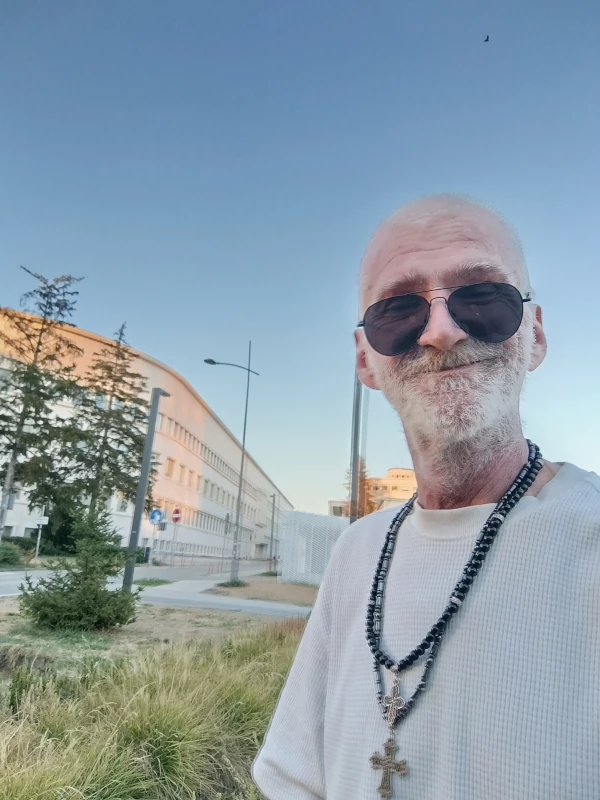

  
  
"Gde se estetika koda susreće sa ručnim radom."

# 👑 Dobrodošao u moje programersko carstvo | zsnsrsart 👑

---

Samostalno gradim svoje projekte, korak po korak, fajl po fajl. Moj kod putuje sa mnom – razvijam ga na mobilnom telefonu, prenosim na računare i stalno ga unapređujem. Sve radim ručno, jer volim da samostalno vodim svaki projekat.

---

### 🧰 Moje Tehnologije i Alati

*   **Web jezici:** HTML5 | CSS3 | JavaScript 
*   **Grafika:** SVG (Ručno kodirane ikone i grafika) & GIMP
*   **Sistemsko programiranje:** C jezik
*   **Hostovanje sajtova:** GitHub Pages (Ubacivanje iz tekst editora)

---

### 🎯 Cilj i način rada

*   ***Izgradnja sajtova:*** Kreiranje modernih, brzih i čistih sajtova iz tekst editora.
*   ***Ručno ažuriranje:*** Osvežavanje i nadogradnja izgrađenih sajtova po potrebi.
*   ***Čist kod:*** Pisanje optimizovanog koda direktno od nule.

---
---
 ⚠️ Važna napomena / Important Notice
---
Molimo vas da pre korišćenja koda pogledate pravila pod stavkom **License**.
---
*Please check the terms under the **License** section before using the code.*
---
---

*"Kod po kod – moje carstvo!"* 🚀
---

### 📂 Moje Programersko Carstvo (Ostali Projekti)

*   [🍳 zsnsrskuvar / zsnsrskuvar](https://github.com/zsnsrskuvar/zsnsrskuvar)
    *Interaktivna digitalna umetnost, gde se spajaju čist HTML, CSS, JavaScript i SVG kod.*

*   [💻 zsnsrcoder / zsnsrscoder](https://github.com/zsnsrscoder/zsnsrscoder)
    *Izložba interaktivne digitalne umetnosti, gde je svaki detalj ručno napisan direktno od nule.*
*  ---

### 🌐 zsnsrsart Sajt Uživo

***Ovaj projekat je uspešno postavljen na GitHub Pages!***

Kliknite na link ispod da biste otvorili zsnsrsart u veb pregledaču:
👉 <a href="https://zsnsrsart.github.io/zsnsrsart" target="_blank">**OTVORI zsnsrsart UŽIVO**</a>
---
---

### 🌐 zsnsrskuvar Sajt Uživo

***Ovaj projekat je uspešno postavljen na GitHub Pages!***

Kliknite na link ispod da biste otvorili zsnsrsart u veb pregledaču:
👉 <a href="https://zsnsrskuvar.github.io/zsnsrskuvar" target="_blank">**OTVORI zsnsrskuvar UŽIVO**</a>
---  
---

 <table align="left" style="margin-top: 20px;">
  <tr>
    <td>
      
       
      <b>Style 1</b>
    </td>
    <td>
      
       
      <b>Style 2</b>
    </td>
  </tr>
</table>
 
